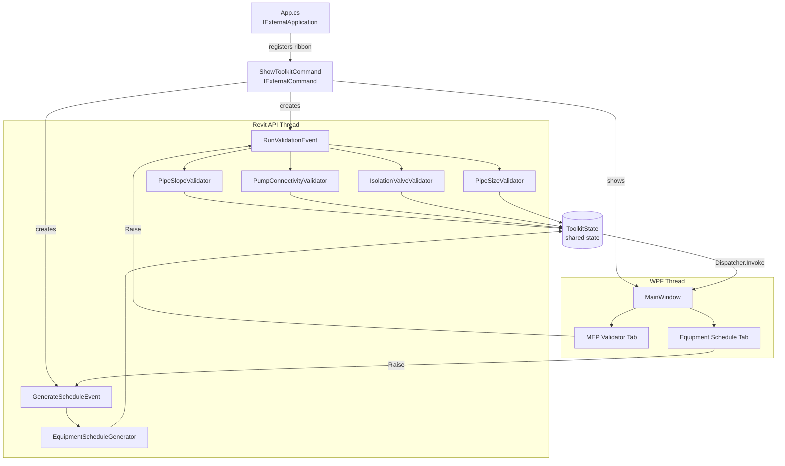

# Water BIM Toolkit

A Revit 2025 add-in for water and wastewater MEP engineers. Provides automated model validation and equipment schedule generation from inside Revit.

---

## Why This Tool Exists

> Most general-purpose Revit QA tools know nothing about water and wastewater systems. They won't catch a gravity pipe that's too flat to drain, a pump missing its isolation valves, or a schedule that drifted out of sync with the model. Water BIM Toolkit fills that gap — domain-specific checks, built for MEP engineers who work on water infrastructure.

### **Prevent Costly Construction Rework from Drainage Failures**

Gravity pipes modeled at the wrong slope — or at zero slope — are one of the most common and expensive errors in water and wastewater projects. A pipe that looks correct in a 3D model can still be completely non-functional if its slope doesn't meet minimum code requirements. In construction, this means tearing out and re-laying installed pipe to fix a problem that should have been caught in design. The toolkit automatically checks every gravity pipe in the model against IPC/IAPMO minimums (1/4"/ft for pipes ≤ 6", 1/8"/ft for larger pipes) and flags violations before the model leaves the engineer's desk.

### **Catch Incomplete Hydraulic Systems Before They Reach Analysis or Construction**

A pump placed in a Revit model but not connected to piping is invisible to most QA processes — it looks fine in a view, it shows up in schedules, but the hydraulic system is broken. Pressure drop calculations, flow simulations, and equipment sizing all produce wrong results when the network has open connectors. **The toolkit scans every pump family instance and flags any unconnected piping connectors as errors**, ensuring the model is topologically complete before it's used for engineering analysis or handed to a contractor.

### **Enforce Maintenance Isolation Requirements at Design Time**

Building codes and facility standards require isolation valves on both sides of every pump so it can be serviced without shutting down the entire system. This requirement is routinely missed in BIM models because Revit has no built-in awareness of the relationship between a pump and its surrounding accessories. **The toolkit walks the pipe graph outward from each pump connector and flags any side — inlet or outlet — that lacks a shutoff, gate, butterfly, ball, or plug valve within three pipe segments.** Catching this in design costs nothing. Retrofitting isolation valves after construction means cutting into installed pipe.

### **Eliminate Fabrication Errors from Missing Reducer Fittings**

When a pipe size changes along a run, a reducer or transition fitting is required. If a coupling or union is used instead — which Revit will happily allow — the model looks connected but the fabrication drawing is wrong. In prefabricated or modular systems this causes parts to arrive on site that don't fit. **The toolkit scans every non-reducer pipe fitting and flags cases where connectors of different diameters meet**, giving engineers the chance to insert the correct fitting before the drawing is issued.

### **Replace Manual Pump Schedules with Model-Driven Data**

Pump schedules are traditionally built in Excel or as Revit schedules maintained separately from the model. They drift out of sync as designs evolve, leading to submittals and specifications that don't match what's been modeled. **The toolkit generates the equipment schedule directly from model parameters — flow rate, total dynamic head, motor HP, material — and cross-checks each pump's bounding box against surrounding structure to flag clearance conflicts.** One click produces a schedule that is guaranteed to reflect the current model state, exportable to CSV for use in specifications, submittals, and coordination packages.

### **Automate What Would Otherwise Be Hours of Manual Model Review**

Without this tool, a QA reviewer must open every gravity pipe's properties to check its slope, visually trace pipe runs to verify valve placement, and manually compare pump schedules against model data — a process that takes hours on a large project and is error-prone regardless of how careful the reviewer is. **The toolkit compresses that process into a single button click, producing a filtered, severity-ranked issue list with element IDs that can be used to navigate directly to the problem in Revit.** Results export to CSV for inclusion in QA reports or design review packages.

---

## Features

### MEP Validator

Runs four checks against the active Revit document and reports issues with severity, element ID, and level location.

| Check | Rule |
|---|---|
| **Pipe Slope** | Gravity pipes (sanitary, storm, drain, sewer, waste) must meet minimum slope: ≥ 1/4"/ft for pipes ≤ 6", ≥ 1/8"/ft for larger pipes |
| **Pump Connectivity** | All piping connectors on pump family instances must be connected |
| **Isolation Valves** | Each pump must have a gate, butterfly, ball, plug, or shutoff valve within 3 pipe segments of each connector |
| **Pipe Size Mismatch** | Non-reducer fittings (couplings, unions, tees) must not connect pipes of different diameters |

Results can be filtered by severity (Error / Warning / Info) and exported to CSV.

### Equipment Schedule

Collects every pump in the model and builds a schedule table with:

- Family name and type
- Level
- Flow rate (GPM), Total Dynamic Head (ft), Motor HP
- Body material
- Maintenance clearance check — flags pumps with walls, columns, structural framing, or other equipment within 3 ft

Schedule can be exported to CSV.

## Requirements

- **Revit 2027**
- **.NET 10 SDK** (for building)
- **Visual Studio 2022** or the `dotnet` CLI

## Building

1. Clone the repository
2. Open `WaterBIMToolkit.csproj` in Visual Studio 2022 (or run `dotnet build` from the project root)
3. Build — the post-build step automatically copies `WaterBIMToolkit.dll` and `WaterBIMToolkit.addin` to `%APPDATA%\Autodesk\Revit\Addins\2027\`

If Revit 2025 is installed at a non-default path, override the property before building:

```
dotnet build -p:RevitInstallPath="D:\Autodesk\Revit 2025"
```

## Installation

If you prefer a manual install instead of building from source:

1. Copy `WaterBIMToolkit.dll` to `%APPDATA%\Autodesk\Revit\Addins\2027\`
2. Copy `WaterBIMToolkit.addin` to the same folder
3. Launch Revit 2025

## Usage

1. Open a Revit project containing MEP/plumbing content
2. Go to the **Add-Ins** tab
3. Click **Water BIM Toolkit**
4. Use the **MEP Validator** tab to run checks and review issues
5. Use the **Equipment Schedule** tab to generate and export the pump schedule

The window is modeless — it stays open while you work in Revit.

## Architecture



> **Thread boundary:** The WPF window runs on its own UI thread. All Revit API calls happen on the Revit API thread via `ExternalEvent`. The `ToolkitState` singleton passes data between threads; `Dispatcher.Invoke` marshals UI updates back to the WPF thread.

## Project Structure

```
WaterBIMToolkit/
├── App.cs                             # IExternalApplication — ribbon registration
├── ToolkitState.cs                    # Shared state between Revit thread and UI thread
├── WaterBIMToolkit.addin              # Revit addin manifest
├── WaterBIMToolkit.csproj
├── Commands/
│   └── ShowToolkitCommand.cs          # IExternalCommand — opens the window
├── Events/
│   ├── RunValidationEvent.cs          # IExternalEventHandler — runs validators on Revit thread
│   └── GenerateScheduleEvent.cs       # IExternalEventHandler — runs schedule generator on Revit thread
├── Models/
│   ├── ValidationIssue.cs
│   └── PumpData.cs
├── Validators/
│   ├── PipeSlopeValidator.cs
│   ├── PumpConnectivityValidator.cs
│   ├── IsolationValveValidator.cs
│   └── PipeSizeValidator.cs
├── Schedule/
│   └── EquipmentScheduleGenerator.cs
└── UI/
    ├── MainWindow.xaml
    └── MainWindow.xaml.cs
```

## License

MIT
