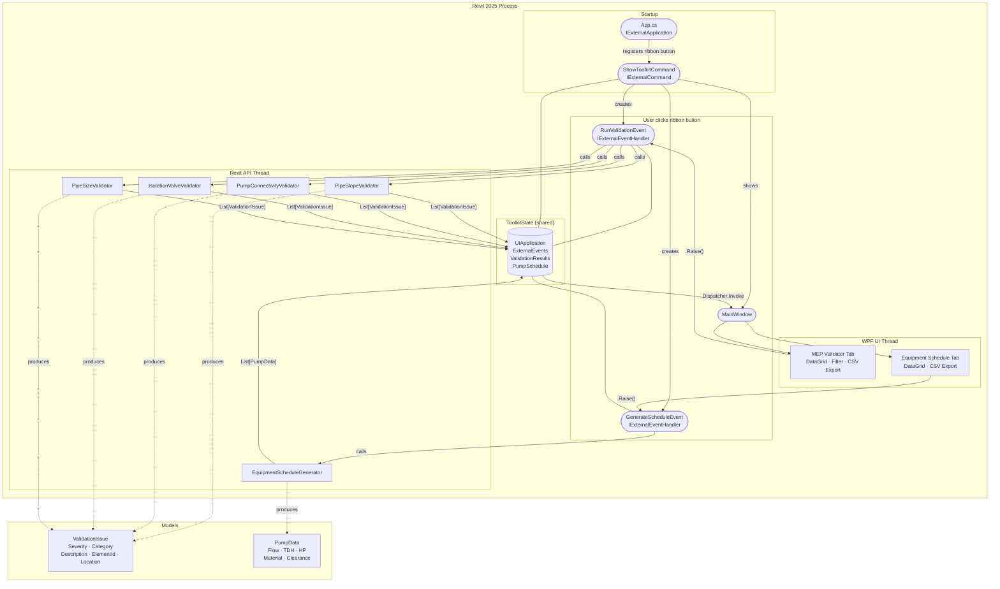

# Water BIM Toolkit

A Revit 2025 add-in for water and wastewater MEP engineers. Provides automated model validation and equipment schedule generation from inside Revit.

## Features

### MEP Validator

Runs four checks against the active Revit document and reports issues with severity, element ID, and level location.

| Check | Rule |
|---|---|
| **Pipe Slope** | Gravity pipes (sanitary, storm, drain, sewer, waste) must meet minimum slope: ≥ 1/4"/ft for pipes ≤ 6", ≥ 1/8"/ft for larger pipes |
| **Pump Connectivity** | All piping connectors on pump family instances must be connected |
| **Isolation Valves** | Each pump must have a gate, butterfly, ball, plug, or shutoff valve within 3 pipe segments of each connector |
| **Pipe Size Mismatch** | Non-reducer fittings (couplings, unions, tees) must not connect pipes of different diameters |

Results can be filtered by severity (Error / Warning / Info) and exported to CSV.

### Equipment Schedule

Collects every pump in the model and builds a schedule table with:

- Family name and type
- Level
- Flow rate (GPM), Total Dynamic Head (ft), Motor HP
- Body material
- Maintenance clearance check — flags pumps with walls, columns, structural framing, or other equipment within 3 ft

Schedule can be exported to CSV.

## Requirements

- **Revit 2025** (tested on 2025.x)
- **.NET 8 SDK** (for building)
- **Visual Studio 2022** or the `dotnet` CLI

## Building

1. Clone the repository
2. Open `WaterBIMToolkit.csproj` in Visual Studio 2022 (or run `dotnet build` from the project root)
3. Build — the post-build step automatically copies `WaterBIMToolkit.dll` and `WaterBIMToolkit.addin` to `%APPDATA%\Autodesk\Revit\Addins\2025\`

If Revit 2025 is installed at a non-default path, override the property before building:

```
dotnet build -p:RevitInstallPath="D:\Autodesk\Revit 2025"
```

## Installation

If you prefer a manual install instead of building from source:

1. Copy `WaterBIMToolkit.dll` to `%APPDATA%\Autodesk\Revit\Addins\2025\`
2. Copy `WaterBIMToolkit.addin` to the same folder
3. Launch Revit 2025

## Usage

1. Open a Revit project containing MEP/plumbing content
2. Go to the **Add-Ins** tab
3. Click **Water BIM Toolkit**
4. Use the **MEP Validator** tab to run checks and review issues
5. Use the **Equipment Schedule** tab to generate and export the pump schedule

The window is modeless — it stays open while you work in Revit.

## Architecture



> **Thread boundary:** The WPF window runs on its own UI thread. All Revit API calls happen on the Revit API thread via `ExternalEvent`. The `ToolkitState` singleton passes data between threads; `Dispatcher.Invoke` marshals UI updates back to the WPF thread.

## Project Structure

```
WaterBIMToolkit/
├── App.cs                             # IExternalApplication — ribbon registration
├── ToolkitState.cs                    # Shared state between Revit thread and UI thread
├── WaterBIMToolkit.addin              # Revit addin manifest
├── WaterBIMToolkit.csproj
├── Commands/
│   └── ShowToolkitCommand.cs          # IExternalCommand — opens the window
├── Events/
│   ├── RunValidationEvent.cs          # IExternalEventHandler — runs validators on Revit thread
│   └── GenerateScheduleEvent.cs       # IExternalEventHandler — runs schedule generator on Revit thread
├── Models/
│   ├── ValidationIssue.cs
│   └── PumpData.cs
├── Validators/
│   ├── PipeSlopeValidator.cs
│   ├── PumpConnectivityValidator.cs
│   ├── IsolationValveValidator.cs
│   └── PipeSizeValidator.cs
├── Schedule/
│   └── EquipmentScheduleGenerator.cs
└── UI/
    ├── MainWindow.xaml
    └── MainWindow.xaml.cs
```

## License

MIT
